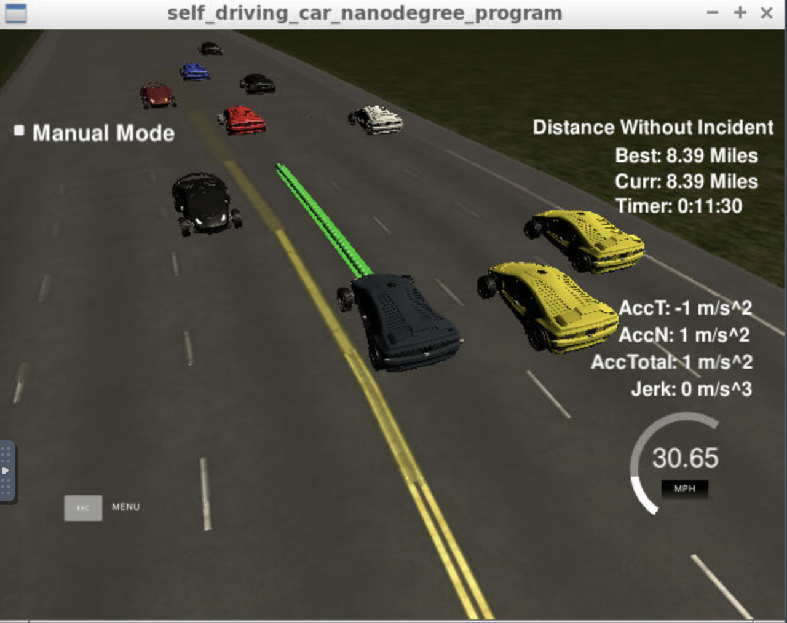
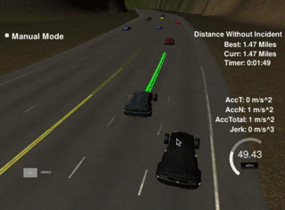
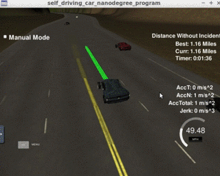
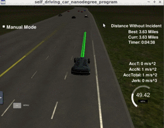

# CarND-Path-Planning-Project
Self-Driving Car Engineer Nanodegree Program

## Description



### Goal
In this project a path planner is implemented for a vehicle. The path planner should ensure that the vehicle can navigate safely around the track while being able to keep the lane, perform lane changes and avoid collisions with other vehicles. For this, localization, sensor fusion and map data are used. 

### Files
The path planner is implemented in the following files
```
.
├── Eigen-3.3
├── helpers.h
├── json.hpp
├── main.cpp
└── spline.h
```
All components of the path planner are included in the `main.cpp`.
The `spline.h` is used to generate smooth path trajectories. 
Because of using the spline library and not the quintic polynomial solver for path generation, the Eigen-3.3 library is not used.

### Components of the path planner
The path planner consists of the following components
1. **Trajectory generation**: generate a smooth path for the car to follow
2. **Sensor fusion**: use sensor fusion to gather information about the other vehicles such as their speed and the lane they are driving on
3. **Speed control and collision avoidance**: acceleration and deceleration for speed adjustment
4. **Lane switching/keeping**: under which circumstances to switch lanes or keep driving at the current lane
5. **Behavior planning (especially lane choosing)**: strategies for setting a future lane to drive in

#### Trajectory generation
Trajectory generation is a rather low level action which gets the car to move according to the lane lines.
The trajectories should be smooth and follow the form of the lanes (i.e. no driving outside of lanes or directly on the lane lines).
The code for generating trajectories is based on the `spline` library and is mostly adopted from the Project Q&A video with only minor changes.
The code corresponding to trajectory generation can be found from approx. line 324 - 442 in `main.cpp`.

#### Sensor fusion
We use sensor fusion to obtain information about the other vehicles on the road, such as their speed, their lanes and their distance to our ego vehicle.
These type of information will be used in all the other components, such as speed control, lane switching and lane choosing. The code for sensor fusion can be found in line 161-209 in `main.cpp`.


#### Speed control and collision avoidance
Speed control is about setting the acceleration and deceleration behavior of the vehicle such that it moves according to the specified speed limit or adapts to the speed of the leading vehicles. 

The problem with the simple speed control strategy from the project Q&A is that when we're driving behind another car, our car constantly accelerates and decelerates by a constant 0.224mph per 0.2seconds. This leads to situations where we constantly overshoot the acceleration/deceleration, which does not correspond to fuel efficient driving behavior. 

To remedy this a simple speed controller was used instead.  When driving behind a leading vehicle (the one directly in front of our ego vehicle on the same lane) we use information from sensor fusion to get the speed and the position of the leading car in Frenet coordinates, especially the s coordinate. When the leading car is within a certain safety distance (and if lane changes are not possible) we tell our ego vehicle to decelerate by only what is necessary in order to keep the same velocity as the leading vehicle. When free driving becomes possible again, we tell our vehicle to accelerate until it reaches the target speed of 49.5mph. 

As an additional safety measure we can add a collision avoidance mechanism by measuring the distance to the leading vehicle. If that distance falls below, let's say, 15m, we tell the controller to engage in emergency braking by setting a higher (e.g. 0.336mph per 20ms which corresponds to 7.5 meters/sec^2).

The part about speed control and collision avoidance can be found in the `main.cpp`s line 262-280.

An example of the speed control in action:




#### Lane switching
Lane switching is implemented by using sensor fusion information to measure the distance of other cars to our ego vehicle. We distinguish between the two situations: a) driving behind a leading vehicle or b) free driving (no traffic ahead).

In situation a), we measure the distance between our vehicle and other vehicles. 
If a vehicle is on the same lane as us and the distance falls below a certain safety distance (let's say 30m), we check if a lane change is possible by measuring the distance of the vehicles on the adjacent lane(s). If, on the adjacent lane(s), no vehicle is within 30m in front or behind us, we perform the lane change (line 194 - 209 and line 254 - 260). If a lane change is not possible due to other vehicles being present within the safety distance, we tell the vehicle to keep the current lane and to eventually slow down if needed.

For situation b) there are two lane changing strategies which are as follows.

#### Behavior planning and lane choosing

This is a more high-level strategic component for choosing a certain driving behavior with regards to lane changing. These driving strategies come into play only during free driving situations, i.e. when there is no traffic in front of our ego vehicle.
For demonstration purposes I am switching between these two strategies depending on which half of the track our car is on at a given moment. This is identified by comparing the Frenet s coordinates of our ego vehicle to half the length of the track.

The code can be found on lines 211 - 244 and 284 - 314.

**"Keep right" strategy**
For the first half of the track the strategy is for the car to keep as much on the right lane as possible. This is done to reflect a sort of driving behavior where the driver adheres to the legal requirement of some countries (for example, in Germany, after overtaking a car on the middle lane the driver should return to the right lane as soon as possible).

This type of lane choosing strategy can be seen in the following animation: 


After overtaking the car on the left lane, the car switches back to the middle lane and shortly after, to the right lane.

**"Choose lane with lowest cost" strategy**
For the second half of the track the strategy is switched to choosing the "most efficient" lane. The optimality of a lane is determined by a certain cost function.
The cost is calculated as a weighted sum of two cost components: the cost for switching lanes and the cost for driving below the speed limit.

The cost for switching lanes is computed as:
```
lane_switch_cost = delta_lane * (1-exp(-delta_lane))
```
where `delta_lane = abs(current_lane - other_lane)`. Due to there only being three distinct lanes, there are only three discrete values that the cost for switching lanes can have. By setting the cost for lane changes this way, we can ensure that no unnecessary lane switches are made (e.g. if we are on right most lane, then switching to the left most lane is penalized more than switching to the center lane)


The second type of cost is introduced as a penalty for driving below the speed limit.
The speed cost is computed as:
```
speed_cost = abs(speed_lim - speed_lane)/speed_lim
```
where `speed_lim` is the speed limit of 50mph and `speed_lane` is the speed on a certain lane, which is calculated as the average speed of all vehicles within 70m ahead of our ego vehicle on each lane (here we assume that we are capable of looking ahead 70m). Getting the average speed for each lane is done in the sensor fusion part. If a lane has no traffic and the car is able to drive at the speed limit no cost is incurred.

Finally the overall cost for a lane is calculated by summing up the two costs while assigning the `speed_cost` a weight of 5 and the `lane_switch_cost` a weight of 1.

``` sum_cost = lane_switch_cost + 5*speed_cost ```

Basically this driving strategy simulates a situation where e.g. the driver is in a hurry and is trying to maximize efficiency by choosing the most optimal lane. By using these two cost components we can make sure that the car only changes lanes if there is a significant benefit to changing lanes by achieving e.g. a higher speed on said lane. Furthermore we can prevent unnecessary double lane changes (if there are e.g. two empty lanes, the vehicles should choose the one closest to the current lane).

This type of driving strategy can be seen in the following animation. We can observe that the car chooses to change to an empty lane quite early even if there is no immediate traffic in order to avoid traffic further along the road.




### Observations
After multiple rounds of testing it is confirmed the path planner can definitely complete the required 4.32 miles for one lap. The furthest I have observed is about close to 9 miles. 

However I have still observed random moments where one of the conditions was violated which raises the suspicition that sometimes the connection between the path planner program and the simulator gets lost. For example I ran into the specific situation many times that the car has followed the leading vehicle perfectly for several minutes and then suddenly the vehicle accelerates for no reason at all, causing a collision violation. Also on other occasions there were debug statements which are usually printed to the command line which suddenly were not printed any more. I am not sure if this has something to do with my slow internet connection (I'm working on the Udacity workspace).

## Instructions

#### The map of the highway is in data/highway_map.txt
Each waypoint in the list contains  [x,y,s,dx,dy] values. x and y are the waypoint's map coordinate position, the s value is the distance along the road to get to that waypoint in meters, the dx and dy values define the unit normal vector pointing outward of the highway loop.

The highway's waypoints loop around so the frenet s value, distance along the road, goes from 0 to 6945.554.

## Basic Build Instructions

1. Clone this repo.
2. Make a build directory: `mkdir build && cd build`
3. Compile: `cmake .. && make`
4. Run it: `./path_planning`.

Here is the data provided from the Simulator to the C++ Program

#### Main car's localization Data (No Noise)

["x"] The car's x position in map coordinates

["y"] The car's y position in map coordinates

["s"] The car's s position in frenet coordinates

["d"] The car's d position in frenet coordinates

["yaw"] The car's yaw angle in the map

["speed"] The car's speed in MPH

#### Previous path data given to the Planner

//Note: Return the previous list but with processed points removed, can be a nice tool to show how far along
the path has processed since last time. 

["previous_path_x"] The previous list of x points previously given to the simulator

["previous_path_y"] The previous list of y points previously given to the simulator

#### Previous path's end s and d values 

["end_path_s"] The previous list's last point's frenet s value

["end_path_d"] The previous list's last point's frenet d value

#### Sensor Fusion Data, a list of all other car's attributes on the same side of the road. (No Noise)

["sensor_fusion"] A 2d vector of cars and then that car's [car's unique ID, car's x position in map coordinates, car's y position in map coordinates, car's x velocity in m/s, car's y velocity in m/s, car's s position in frenet coordinates, car's d position in frenet coordinates. 

## Details

1. The car uses a perfect controller and will visit every (x,y) point it recieves in the list every .02 seconds. The units for the (x,y) points are in meters and the spacing of the points determines the speed of the car. The vector going from a point to the next point in the list dictates the angle of the car. Acceleration both in the tangential and normal directions is measured along with the jerk, the rate of change of total Acceleration. The (x,y) point paths that the planner recieves should not have a total acceleration that goes over 10 m/s^2, also the jerk should not go over 50 m/s^3. (NOTE: As this is BETA, these requirements might change. Also currently jerk is over a .02 second interval, it would probably be better to average total acceleration over 1 second and measure jerk from that.

2. There will be some latency between the simulator running and the path planner returning a path, with optimized code usually its not very long maybe just 1-3 time steps. During this delay the simulator will continue using points that it was last given, because of this its a good idea to store the last points you have used so you can have a smooth transition. previous_path_x, and previous_path_y can be helpful for this transition since they show the last points given to the simulator controller with the processed points already removed. You would either return a path that extends this previous path or make sure to create a new path that has a smooth transition with this last path.

## Tips

A really helpful resource for doing this project and creating smooth trajectories was using http://kluge.in-chemnitz.de/opensource/spline/, the spline function is in a single hearder file is really easy to use.

---

## Dependencies

* cmake >= 3.5
  * All OSes: [click here for installation instructions](https://cmake.org/install/)
* make >= 4.1
  * Linux: make is installed by default on most Linux distros
  * Mac: [install Xcode command line tools to get make](https://developer.apple.com/xcode/features/)
  * Windows: [Click here for installation instructions](http://gnuwin32.sourceforge.net/packages/make.htm)
* gcc/g++ >= 5.4
  * Linux: gcc / g++ is installed by default on most Linux distros
  * Mac: same deal as make - [install Xcode command line tools]((https://developer.apple.com/xcode/features/)
  * Windows: recommend using [MinGW](http://www.mingw.org/)
* [uWebSockets](https://github.com/uWebSockets/uWebSockets)
  * Run either `install-mac.sh` or `install-ubuntu.sh`.
  * If you install from source, checkout to commit `e94b6e1`, i.e.
    ```
    git clone https://github.com/uWebSockets/uWebSockets 
    cd uWebSockets
    git checkout e94b6e1
    ```


