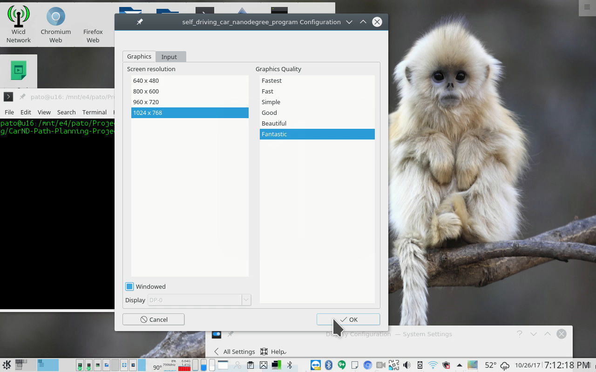

# Udacity Self Driving Car Engineer nanodegree

# Term 3 Project 1: Path Planning

## Overview

The goal of this project is to navigate a vehicle along a virtual six-lane highway (three in opposite directions) that is 4.32 miles in length with a few restrictions:

- car does not drive faster than 50mph
- car does not exceed a total acceleration of 10 m/s^2 and a jerk of 10 m/s^3.
- cannot collide with any vehicle
- car does not spend more than 3 seconds outside the lane lines while changing lanes, and every other time the car stays inside one of the 3 lanes on the right hand side of the road
- car is able to smoothly change lanes when it makes sense to do so, such as when it is behind a slower moving car and an adjacent lane is clear of other traffic

## Model Implementation

Much of the insight for my implementation was gleaned from the Project Walkthrough Q&A video that David Silver and Aaron Brown provided for this project.

Sensors on the vehicle provide the car's Cartesian (x, y) and Frenet (s, d) coordinates, in addition to its yaw and speed.  They also provide the same coordinates and velocity data (vx, vy) about the other vehicles around it, making it possible to determine whether the car can safely change lanes.  The Frenet latitudinal value (d) for each vehicle is relative to the median strip that separates the opposing lanes of traffic.  This data is used in my implementation to decide whether to accelerate,  decelerate, stay in the current lane, or switch lanes if a car ahead is driving too slow, in order to provide a comfortable, non-aggravating driving experience. 

Starting with a reference velocity of zero in the middle of a busy highway, the vehicle gradually accelerates until we reach a target velocity of 49.5 mph to stay within the 50 mph speed limit imposed by the project rubric.

When the sensors indicate that a vehicle in front of us is less than 30 meters ahead, the car performs one of the following actions, depending on which lane it is in:

- switch to the left lane if there is no vehicle within 30 meters ahead or behind our current longitudinal position (s)
- otherwise, switch to the right lane using the same criteria
- if neither left nor right lanes are safe to switch to, slow down until there is at least 30 meters distance between our car and the car in front of it

When the action involves making a lane change, a new target lane value is assigned.  Please refer to lines 288-300 in main.cpp.

Next, we begin the task of calculating prediction waypoints to set a path for the vehicle to follow.  First, we generate five anchor points that will be used to generate a cubic spline interpolation function.  The first two anchor points are the two last points of the previous path (or two points that make the path tangent to the car if two previous last points don't exist).  For the next three anchor points, we calculate three waypoints using Frenet coordinates (please refer to lines 344-349 in `main.cpp`).  Their longitudinal (s) values are calculated as 30m, 60m, and 90m ahead of the car's current `s` value.  Further, latitudinal distance (d) for these waypoints are calculated as 2 + 4 * lane index, where the left most lane's index is 0, and the right most lane's index is 2.  Each lane is 4 meters wide, and the `2` in the formula refers to the middle of the left-most lane.  These Frenet coordinates are converted and rotated to Cartesian coordinates using the `getXY()` helper function and the logic in lines 359-366 in `main.cpp`.

Now that we have our five anchor points, we use the spline library header from http://kluge.in-chemnitz.de/opensource/spline, as suggested in the Walkthrough Q&A video, to generate a spline interpolation function, which we will use to calculate the y-coordinate value for a given x-coordinate [y = f(x)] for our prediction path.

Finally, we calculate our prediction path in lines 374-411 in `main.cpp`, which starts with the previous waypoints.  This output path is comprised of 50 points where the vehicle is expected to reach each point after 20ms.  Lines 393-395 in `main.cpp` provide the logic to ensure the points are spaced and positioned to ensure a smooth, minimally jerky experience.  The x and y values for our prediction path are fed back to the simulator for the vehicle to follow.

This model manages to complete the 4.32 mile circuit in about 5 minutes and 54 seconds, without violating any of the restrictions specified in the project rubric.  A video of this implementation is available at https://youtu.be/33I5X-qdBb8:

